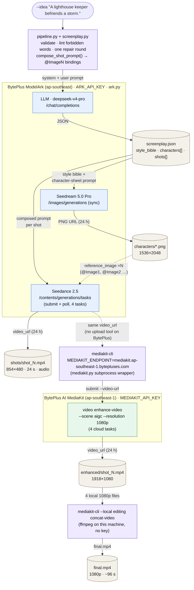
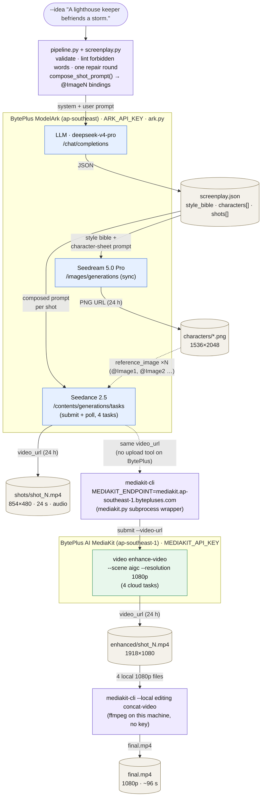

# Seedance 2.5 short film on BytePlus, upscaled with AI MediaKit

One command takes a one-line story idea to a finished, coherent, 1080p short film of a
minute or more — entirely on **BytePlus**, ByteDance's international cloud:

```
idea ──LLM──▶ screenplay.json ──Seedream──▶ characters/*.png ──Seedance 2.5──▶ shots/*.mp4 (480p, 4 × 24 s)
                                                                                     │ (Seedance video_url)
      final.mp4 ◀──mediakit-cli --local concat (ffmpeg)──◀ enhanced/*.mp4 (1080p) ◀──MediaKit enhance-video──┘
```

The point of the example is the **MediaKit** half: Seedance renders cheap 480p clips, and
[BytePlus AI MediaKit](https://docs.byteplus.com/en/docs/byteplus-vod/ai-mediakit-video-quality-enhancement)
— driven through the official CLI, `mediakit-cli`, pointed at the BytePlus endpoint — upscales
each clip to 1080p as a cloud task. The stitch is `mediakit-cli --local editing concat-video`
(ffmpeg on your machine) because the BytePlus deployment does not enable the cloud
`concat-video` tool; see [What is different on BytePlus](#what-is-different-on-byteplus).

This is the BytePlus port of
[`volcengine/mediakit-cli/seedance-short-film`](../../../volcengine/mediakit-cli/seedance-short-film):
same screenplay/character/shot logic, different endpoints, model ids and MediaKit tool set.

Coherence across the four independently generated clips comes from three things the
pipeline enforces:

1. **A screenplay from an LLM** with a four-beat structure, a `style_bible` paragraph that is
   repeated verbatim in every image and video prompt, and a fixed physical description,
   wardrobe and distinguishing feature per character.
2. **One Seedream character sheet per character**, attached to every Seedance request that
   character appears in as a `reference_image`, and addressed in the prompt as `@Image1`,
   `@Image2`, … in the same order.
3. **A gapless per-shot timeline** (`[0s–8s] … [8s–16s] … [16s–24s] …`) plus camera,
   continuity and audio notes, all linted for the words that would make Seedance 2.5
   reinterpret the request (see [sharp edges](#sharp-edges)).

## Architecture



Purple boxes are local code in this directory (including the ffmpeg-backed local concat), tan
cylinders are files written under `--out/`, blue boxes are BytePlus ModelArk API calls made by
`ark.py` with `ARK_API_KEY`, and the green box is the BytePlus AI MediaKit cloud task submitted
through `mediakit-cli` with `MEDIAKIT_API_KEY`. The dotted arrow is the one BytePlus-specific
edge: the Seedance clip's own 24 h URL is what `enhance-video` downloads, because BytePlus has
no upload tool for local files. `state.json` records the task id behind each cloud box so a
re-run re-polls instead of resubmitting (see [Resuming](#resuming-and-statejson)).

<details>
<summary>Mermaid source (rendered above as <code>docs/architecture.png</code>)</summary>



Regenerate the PNG after editing `docs/architecture.mmd`:

```
npx -y @mermaid-js/mermaid-cli -i docs/architecture.mmd -o docs/architecture.png \
    -b white -w 1400 -s 2 -p docs/puppeteer.json
```

</details>

## Example output

A complete run is committed under [`examples/lighthouse/`](examples/lighthouse) so you can see
every intermediate artifact without spending anything. It was produced by

```
python pipeline.py --idea "A lighthouse keeper befriends a living storm." --out runs/lighthouse
```

with the defaults (4 shots × 24 s, 16:9, Seedance 480p → MediaKit 1080p, audio on).


| Path | What it is | Size |
| --- | --- | --- |
| `final.mp4` | The finished film: local concat of the four enhanced clips. 1918×1080, 96.28 s, 24 fps, AAC audio; a stream copy of the four inputs. | 88 MB |
| `enhanced/shot_1..4.mp4` | The four clips after BytePlus MediaKit `enhance-video` (`--scene aigc`, 1080p). | 21–23 MB each |
| `shots/shot_1..4.mp4` | The raw Seedance 2.5 clips, 854×480, 24 s each, as generated. | 14–17 MB each |
| `characters/hero.png`, `characters/storm.png` | The Seedream 5.0 Pro character sheets (1536×2048) attached to every shot as `@Image1` / `@Image2`. Preview: `characters.jpg`. | 5.5–5.8 MB each |
| `screenplay.json` | The LLM's screenplay, with the composed `seedance_prompt` and `reference_ids` per shot — the exact text each Seedance task received. | |
| `state.json` | The resume state: task ids, statuses, timestamps, MediaKit `client_token`s, the MediaKit endpoint used. | |
| `log/ark_shot_N_request.json` / `_result.json` | The Seedance request body and the terminal task record (status, usage, seed, resolution) for each shot. | |
| `log/mediakit_enhance_N.json`, `log/mediakit_concat_final.json` | The completed `query-task` JSON for each enhance task, and the local concat's result JSON. | |

Notes on the sample: URLs inside the logs and state had their signed query strings stripped
and have expired anyway (both Ark and MediaKit URLs live 24 h); the character sheets, storm
design and palette were chosen by the LLM from the one-line idea, not by hand.

## What is different on BytePlus

Everything below was observed against the live service on 2026-08-26, not read from the docs.

| | Volcano Engine example | This example (BytePlus) |
| --- | --- | --- |
| MediaKit endpoint | `https://amk.cn-beijing.volces.com` (CLI default) | `https://mediakit.ap-southeast-1.bytepluses.com` — `mediakit.py` exports it as `MEDIAKIT_ENDPOINT` for its subprocesses, so the CLI's global config is untouched |
| MediaKit key | Volcano Engine AI MediaKit console | [BytePlus VOD console → AI MediaKit → Settings → API key](https://console.byteplus.com/vodpaas/region:vodpaas+ap-southeast-1/ai-mediakit/settings?tab=apiKey) (region `ap-southeast-1`) |
| `enhance-video` input | Local 480p file; the CLI uploads it | **Must be a public HTTPS URL.** The CLI's upload tool answers `AccessDenied: tool request-media-upload-url is not available`, so the pipeline passes the Seedance clip's own `video_url`. MediaKit does a `HEAD` (`GetUrlInfo`) before downloading: hosts that reject `HEAD` fail with `DownloadFileError … http status code is 403`. |
| Stitch | Cloud `editing concat-video` | **Local** `mediakit-cli --local editing concat-video` (ffmpeg, synchronous, no key). Cloud `concat-video` answers `AccessDenied: tool concat-video is not available`, and there is no `--transitions`. |
| Ark | `ark.cn-beijing.volces.com`, `doubao-seedance-2-5-260628`, `doubao-seedream-5-0-pro-260628` | `ark.ap-southeast.bytepluses.com`, `dreamina-seedance-2-5-260628`, `dola-seedream-5-0-pro-260628`; same `deepseek-v4-pro-260425` chat model |
| Task statuses | `processing` / `completed` / `failed` | `running` / `completed` / `failed` (both handled) |
| Docs sample URL | — | The quickstart's `vod-ai-test.byteplus.com/demo/demo_480p.mp4` fails inside MediaKit with `Origin DNS Error`; use your own URL. |

The BytePlus docs list these MediaKit tools: video enhancement, precision erasure, face
blurring, frame extraction, highlight clipping, scene segmentation, video / low-bitrate HD /
audio transcoding, remuxing, audio-video trim / extraction / merging / speed / mixing / volume
/ fade, audio concatenation, voice separation. Video concatenation is not among them.

Two keys from one BytePlus account:

| Env var | Where from |
| --- | --- |
| `ARK_API_KEY` | [BytePlus ModelArk console](https://console.byteplus.com/ark) — enable the three models first |
| `MEDIAKIT_API_KEY` | BytePlus VOD console → AI MediaKit → Settings → API key |

## Files

| File | Role |
| --- | --- |
| `config.py` | Ark base URL and model ids (Seedance 2.5, Seedream 5.0 Pro, chat model) plus the MediaKit endpoint and console URL — all BytePlus. |
| `ark.py` | Small `requests` client for `/chat/completions`, `/images/generations` and `/contents/generations/tasks` (submit + poll), with the retry policy explained below. Identical to the Volcano Engine copy. |
| `mediakit.py` | Subprocess wrapper around `mediakit-cli`: sets `MEDIAKIT_ENDPOINT`, `enhance_video()` (URL input only), `concat_video_local()`, `query_task()`, a shared poll loop, and lenient parsing of the CLI's stdout JSON contract. |
| `screenplay.py` | System/user prompts for the LLM, the screenplay JSON schema and validator, one automatic repair round, and `compose_shot_prompt()` which turns a shot into a Seedance prompt with `@ImageN` bindings. Identical to the Volcano Engine copy. |
| `pipeline.py` | The orchestrator: argparse, `state.json`, five resumable steps, `--dry-run`, `--until`, `--retry-failed`; the enhance step sources from the Seedance URL and the concat step is local. |
| `requirements.txt` | `requests`. `mediakit-cli` (Node) is an external tool; it needs an ffmpeg ≥ 5.1 on `PATH` for the local concat (`mediakit-cli doctor` checks). |
| `docs/` | `architecture.mmd` (mermaid source), `architecture.png` (its render, embedded above) and the `puppeteer.json` used to regenerate it. |

## Run it

```
# 1. MediaKit CLI (Node >= 18) — the same package serves both clouds
npx @volcengine/mediakit-cli install -y
mediakit-cli version

# 2. Python side
pip install -r requirements.txt

# 3. Credentials (both BytePlus)
export ARK_API_KEY=...              # BytePlus ModelArk key
export MEDIAKIT_API_KEY=...         # BytePlus AI MediaKit key
export MEDIAKIT_ENDPOINT=https://mediakit.ap-southeast-1.bytepluses.com   # only needed for manual CLI use;
mediakit-cli doctor                 # pipeline.py sets it itself. cloud_ready and ffmpeg should be ok

# 4. Look before you pay: screenplay + every request body, no media calls
python pipeline.py --idea "A lighthouse keeper befriends a storm." --dry-run

# 5. The real thing (4 shots x 24 s at 480p -> 1080p, ~96 s film)
python pipeline.py --idea "A lighthouse keeper befriends a storm." --out runs/lighthouse

# No MediaKit key yet? Ark only: raw 480p clips stitched locally
python pipeline.py --idea "..." --out runs/lighthouse --skip-enhance
```

Progress is printed to stderr; the final summary (paths, task ids) is JSON on stdout.
Outputs land in `--out` (default `runs/<timestamp>-<slug>`):

```
state.json          resume state (task ids, URLs, timestamps, MediaKit endpoint)
screenplay.json     the LLM's plan + the composed Seedance prompt per shot (edit and re-run)
characters/*.png    Seedream character sheets
shots/shot_N.mp4    Seedance 480p clips
enhanced/shot_N.mp4 MediaKit 1080p clips
final.mp4           local concat
log/*.json          raw request/result JSON for every task
```

Useful flags (all defaults shown):

| Flag | Default | Note |
| --- | --- | --- |
| `--shots` / `--shot-seconds` | `4` / `24` | Seedance 2.5 accepts 4–30 s per clip; 24 s is deliberately near the top to stress long clips. |
| `--ratio` | `16:9` | Passed straight to Seedance. |
| `--seedance-resolution` | `480p` | What Seedance renders. The whole point is to render low and upscale. |
| `--enhance-resolution` / `--enhance-scene` / `--enhance-tool-version` / `--bitrate-level` | `1080p` / `aigc` / `standard` / `medium` | MediaKit `enhance-video` parameters. `--enhance-resolution` accepts `240p…1080p, 2k, 4k, 8k` on BytePlus; scenes are `common, ugc, short_series, aigc, old_film`. |
| `--no-audio` | off | `generate_audio=false` for every shot. Applied uniformly so the concat never mixes clips with and without an audio track. |
| `--style "…"` / `--max-characters` | – / `3` | Handed to the LLM. Fewer characters → better consistency. |
| `--screenplay file.json` | – | Skip the LLM and use your own screenplay (must pass the same validator). |
| `--dry-run` | – | Screenplay + all request bodies, then exit. Only the LLM is called. |
| `--until screenplay\|characters\|shots\|enhance\|concat` | – | Stop after a step. |
| `--retry-failed` | – | Resubmit shots / tasks whose last attempt failed (billed). Without it, a failed item stops the run and tells you why. |
| `--fresh --yes` | – | Discard a non-empty `--out`. |
| `--skip-enhance` | – | Stitch the raw 480p clips; the whole run then needs only Ark credentials. |
| `--mediakit-schema` | – | Print `enhance-video` `--schema` output and exit. |

## What the example sends

### Seedance 2.5 (one task per shot)

`POST {base_url}/contents/generations/tasks`, `Authorization: Bearer $ARK_API_KEY`, plus an
`X-Client-Request-Id` so a retried POST cannot create a second billed task.

| Field | Value | Note |
| --- | --- | --- |
| `model` | `doubao-seedance-2-5-260628` | `config.py` |
| `content[0]` | `{"type": "text", "text": <composed prompt>}` | see below |
| `content[1..]` | `{"type": "image_url", "image_url": {"url": …}, "role": "reference_image"}` | one per character in the shot, in `@ImageN` order |
| `ratio` | `16:9` | |
| `duration` | `24` | seconds; = the last timeline window's end |
| `resolution` | `480p` | |
| `generate_audio` | `true` | dialogue and ambience are rendered by Seedance itself |
| `omni_reference_task_type` | `auto` | |
| `output_format` / `watermark` | `mp4` / `false` | |
| `execution_expires_after` | `3600` | seconds |

Result: `GET …/tasks/{id}` until `status` is `succeeded` (`content.video_url`, valid 24 h) or
`failed` / `expired` / `cancelled`.

A composed prompt looks like this (from `screenplay.json`):

```
@Image1 is Ansel Roe: a 60-year-old broad-shouldered man with …, wearing a navy wool peacoat …; a brass pocket-watch chain across his chest. Keep this exact face, hair and outfit.
@Image2 is Nimbe: a child-sized figure made of swirling grey cloud …. Keep this exact face, hair and outfit.
Each referenced person appears exactly once in frame.
The storm creature accidentally snuffs the lamp. Location: lighthouse gallery, night.
[0s–8s] @Image2 sneezes lightning and the great lamp goes dark
[8s–16s] @Image1 fumbles for matches as a ship's horn sounds far off
[16s–24s] @Image2 glows brighter and brighter until the whole gallery is lit blue
Camera: tight close-ups, then a slow pull back to a wide shot
Continuity: blue storm light takes over from amber
Audio: ship horn, wind howling, piano swells. Dialogue: [9s–13s] @Image1 says "Hold on, hold on." (low, gravelly); … No subtitles or on-screen text.
Style: Painterly 2D animation with soft gouache textures, muted teal and amber palette, …
```

### Seedream 5.0 Pro (one image per character)

`POST {base_url}/images/generations` with `model`, `prompt` (style bible + full-body
reference-sheet instructions), `size: "1536x2048"` (3:4 — an explicit `WxH` so the model cannot
pick its own aspect ratio; 0.75 sits inside Seedance's 0.4–2.5 reference-image window),
`output_format: "png"`, `watermark: false`, `response_format: "url"`. Synchronous; the URL
lives 24 h and the PNG is also saved locally.

### MediaKit (CLI, `MEDIAKIT_ENDPOINT=https://mediakit.ap-southeast-1.bytepluses.com`)

```
mediakit-cli --cloud video enhance-video --video-url <Seedance video_url of shot 1> \
    --scene aigc --tool-version standard --resolution 1080p --bitrate-level medium \
    --client-token <run_id>-enh-1
mediakit-cli shared query-task --task-id <task_id>
mediakit-cli --local editing concat-video --video-urls enhanced/shot_1.mp4,…,enhanced/shot_4.mp4 \
    --output-path final.mp4
```

Under the CLI that is `POST /api/v1/tools/enhance-video` with `{"video_url", "scene",
"tool_version", "resolution", "bitrate_level", "client_token"}` and `GET /api/v1/tasks/{id}`,
`Authorization: Bearer $MEDIAKIT_API_KEY`.

- `enhance-video` gets the **Seedance result URL** (public, 24 h). There is no upload on
  BytePlus, so the enhance step must run within ~22 h of the clip being generated
  (`clip_source_url()` refuses older URLs and tells you how to re-host the local clip and set
  `shots[N].seedance.source_url_override` in `state.json`).
- The local concat gets the four **downloaded** 1080p clips; no MediaKit URL is reused.
- The pipeline runs its own poll loop over `query-task` (every 15 s, all tasks per tick) so it
  can persist progress; `--poll-complete` is the CLI's equivalent for manual use.
- Completed tasks report `status, video_url, duration, resolution, fps, tool_version` flattened
  to the top level by the CLI (`result.*` in the raw API); the pipeline downloads `video_url`.
  The docs say the result URL lives 24 h and is auto-renewed by a query when < 2 h remain.

## How the screenplay drives the prompts

The LLM (`/chat/completions`, `deepseek-v4-pro` by default, `ARK_LLM_MODEL` to override) is
asked for a JSON object — title, logline, `style_bible`, `characters[]` (id, name,
description, wardrobe, distinguishing feature, voice) and `shots[]` (summary, location,
time of day, cast, gapless timeline, camera, continuity, audio, dialogue). Characters are
referenced in shot text **only** as `{id}` placeholders.

`screenplay.validate()` checks the structure (shot count, timeline gapless and ending at
`--shot-seconds`, placeholders resolving to that shot's cast, dialogue windows, length caps)
and lints every text field for forbidden words. If anything fails, the violations are sent
back to the model once for a repair; if it still fails, the run stops with the list.

`compose_shot_prompt()` then maps each `{id}` to `@ImageN` in the order of the shot's
`characters` list and returns that same list, which `pipeline.py` uses to build `content[]`
— so the ordinal in the prompt and the position of the image in the request come from a
single source and cannot drift.

`screenplay.json` is the contract: edit a shot's `seedance_prompt` there and re-run, and
only shots without a clip yet are submitted with the new text.

## Resuming and `state.json`

Every step is idempotent. Re-running the same command:

- reuses `screenplay.json` and `characters/*.png` if present;
- never resubmits a Seedance/MediaKit task that already has a `task_id` — it re-polls it;
- skips any shot whose clip / enhanced clip / `final.mp4` already exists on disk;
- resubmits only with `--retry-failed`, and only items whose last status was
  `failed` / `expired` / `cancelled` (MediaKit `client_token` gets a `-rN` suffix).

Delete `final.mp4` and re-run to redo just the (local, free) concat; delete
`enhanced/shot_2.mp4` to redo just that upscale — within 22 h of the Seedance clip, see above.

The retry policy inside `ark.py`: retry 429 / 5xx / transport errors up to 3 times, never
other 4xx, and never a **timed-out task-creation POST** — the server may have accepted it, and
a retry would be a second billed generation.

## Sharp edges

1. **Seedance 2.5 infers the task type from the prompt.** Wording like *edit, add, insert,
   remove, delete, modify, replace, change to* marks the request as video editing (forces
   `ratio: adaptive`, `duration: -1`), *extend / continue* as video extension (forces
   `ratio: adaptive`). Validation is asynchronous: the task is accepted, billed, and produces
   the wrong thing. That is why those words are forbidden in the screenplay, linted in every
   field, and scrubbed as a last resort.
2. **`role: first_frame` also forces `ratio: adaptive`**, so the pipeline only ever uses
   `role: reference_image`.
3. **Ark URLs live 24 h** (Seedream and Seedance results). Clips and portraits are downloaded
   immediately. A character sheet URL older than 20 h at submit time is regenerated with a
   warning — that breaks consistency with shots already rendered, so finish shot submission
   within 20 h of `--until characters`.
4. **BytePlus MediaKit has no upload and no cloud concat** (see
   [What is different on BytePlus](#what-is-different-on-byteplus)). Consequences: the Seedance
   URL is the enhance input, so the enhance step has the same 24 h clock; and stitching needs
   ffmpeg on the machine that runs the pipeline.
5. **MediaKit downloads with a `HEAD` first.** A source host that rejects `HEAD` (some
   public buckets do) fails the task with `DownloadFileError … 403` even though `GET` works.
   Ark's Seedance URLs are fine.
6. **`--video-urls` is comma-joined** by the CLI, so inputs containing `,` are rejected up
   front. Boolean CLI flags must be written `--flag` / `--flag=false`, never `--flag false`
   (none are needed here).
7. **MediaKit business errors are in stdout JSON**, not the exit code: `success: false` on
   submit (BytePlus nests it as `error.error.code`), or `status: failed` from `query-task`.
   `mediakit.py` parses stdout first and only logs the exit code.
8. **Local `concat-video` joins whatever tracks the inputs carry** — no audio option. The
   pipeline applies one `generate_audio` setting to all shots so the inputs are homogeneous.
9. **Photoreal portraits can trip Ark's privacy detector**
   (`InputImageSensitiveContentDetected.PrivacyInformation`) when used as references. The LLM
   is told to write a stylised, non-photoreal style bible for that reason; `--style` lets you
   override it.
10. **Ark JSON mode is not relied on.** The LLM is asked for "JSON only" and the response is
    parsed leniently (fences and surrounding prose are stripped).
11. **MediaKit keeps the source aspect ratio exactly**: a 854×480 Seedance clip comes back as
    1918×1080, not 1920×1080. Harmless for concat (all clips match), but worth knowing if a
    downstream tool insists on 1920.
12. **Models may need activating** in the BytePlus ModelArk console before the first call
    returns anything but `InvalidEndpointOrModel.NotFound`.

## Verification status

Verified **live, end to end, on BytePlus** on 2026-08-26 (the run committed under
`examples/lighthouse/`; task ids in its `state.json`):

- **LLM** (`deepseek-v4-pro-260425`, `/chat/completions` on `ark.ap-southeast.bytepluses.com`):
  returned the JSON schema without fences; the run needed the automatic repair round (it had
  written "continues"). ~2 min per screenplay including the repair.
- **Seedream 5.0 Pro** (`dola-seedream-5-0-pro-260628`): `size 1536x2048` honoured exactly;
  5.5–5.8 MB PNGs; ~60 s per image.
- **Seedance 2.5** (`dreamina-seedance-2-5-260628`), `resolution 480p`, `ratio 16:9`,
  `generate_audio true`, 1–2 `reference_image` parts per task, 4 × 24 s clips submitted
  back-to-back: all `succeeded` — **854×480**, 24 fps, h264 ~5.4 Mbps + AAC 128 kbps, 24.06 s,
  14–17 MB each, **230 980 tokens per clip**. Wall per task 229 / 292 / 308 / **736** s —
  BytePlus queueing varies a lot more than Volcano Engine's 161–215 s; all four were done 12.5 min
  after submission. `ratio`/`duration` were honoured (not `adaptive`); character identity held.
- **BytePlus MediaKit `enhance-video`** (`--scene aigc --tool-version standard --resolution
  1080p --bitrate-level medium`, input = the Seedance `video_url`): submit ~1 s per clip (no
  upload); the four 24 s tasks ran in parallel and all completed **7 min 21–28 s** after
  submission. Output **1918×1080** (854:480 aspect preserved exactly), 24 fps, h264 ~6.9 Mbps,
  **AAC audio preserved**, duration unchanged (24.064 s), 21–23 MB. `query-task` reports
  `status, video_url, duration, resolution, fps, tool_version` (the CLI drops the API's
  `created_at` / `finished_at` / `expires_at`). Output host: `*.vod.ap-southeast-1.byteplusvod.com`.
  A separate probe with a public 10 s 360p clip (no audio) came back 1920×1080 at 30 fps, 9 MB,
  in about 2 min.
- **`mediakit-cli --local editing concat-video`** over the four enhanced clips: ~2 s, a stream
  copy (no re-encode — `final.mp4` is 87.6 MB, the sum of its inputs, versus the 50 MB the
  Volcano Engine cloud concat re-encodes to), 1918×1080, **96.28 s**, audio kept, straight cuts.
- **Negative results, live:** `--cloud editing concat-video` → `AccessDenied: tool concat-video
  is not available`; a local path to `enhance-video` → `AccessDenied: tool
  request-media-upload-url is not available`; the docs' demo URLs → `DownloadFailed …
  Origin DNS Error`; a Google-bucket sample that rejects `HEAD` → `GetUrlInfo … 403`.
- Resume behaviour, live: the first pass stopped after the enhances because the local concat
  wrote to the wrong path (a relative `--output-path` is resolved against the inputs' directory
  — now passed absolute); re-running the same command re-used every clip and ran only the concat.

Verified **without** network: `screenplay.validate()` / `compose_shot_prompt()` /
forbidden-word lint on a fixture; the resume state machine, `--retry-failed`, partial re-runs —
with the Ark and MediaKit calls stubbed (shared with the Volcano Engine example).

**Still taken from the docs, not verified:** the 24 h / auto-renew lifetime of the MediaKit
output URL (consumed within a minute), `client_token` idempotency semantics, and the
`professional` tool version, `enhance_style`, `fps` interpolation and `bit_depth` options.
