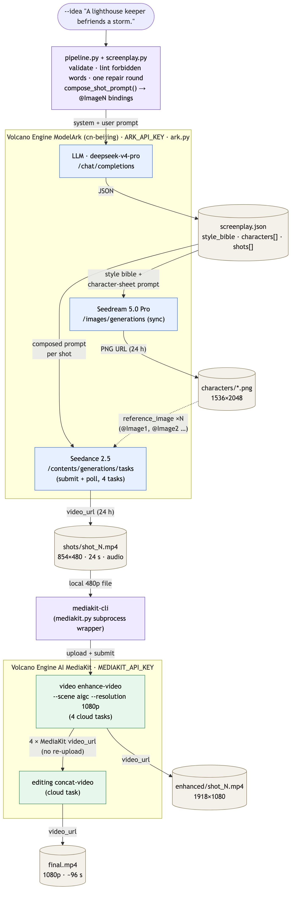
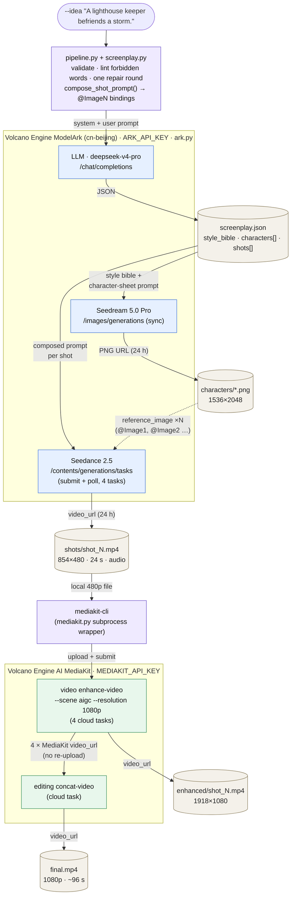
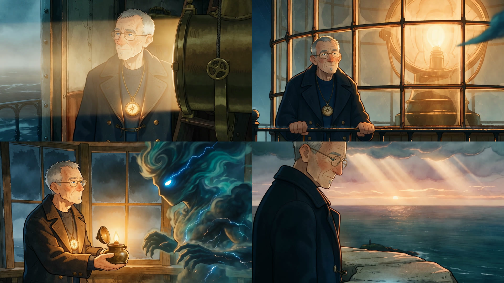

# Seedance 2.5 short film, upscaled and stitched with MediaKit

One command takes a one-line story idea to a finished, coherent, 1080p short film of a
minute or more:

```
idea ──LLM──▶ screenplay.json ──Seedream──▶ characters/*.png ──Seedance 2.5──▶ shots/*.mp4 (480p, 4 × 24 s)
                                                                                     │
      final.mp4 ◀──MediaKit concat-video──◀ enhanced/*.mp4 (1080p) ◀──MediaKit enhance-video──┘
```

The point of the example is the **MediaKit** half: Seedance renders cheap 480p clips, and
[AI MediaKit](https://www.volcengine.com/product/ai-mediakit) — driven through its official
CLI, `mediakit-cli` — does the post-production: `video enhance-video` upscales each clip to
1080p, `editing concat-video` stitches them, both as cloud tasks. Nothing is re-encoded
locally; ffmpeg is not required.

Coherence across the four independently generated clips comes from three things the
pipeline enforces:

1. **A screenplay from an LLM** with a four-beat structure, a `style_bible` paragraph that is
   repeated verbatim in every image and video prompt, and a fixed physical description,
   wardrobe and distinguishing feature per character.
2. **One Seedream character sheet per character**, attached to every Seedance request that
   character appears in as a `reference_image`, and addressed in the prompt as `@Image1`,
   `@Image2`, … in the same order.
3. **A gapless per-shot timeline** (`[0s–8s] … [8s–16s] … [16s–24s] …`) plus camera,
   continuity and audio notes, all linted for the words that would make Seedance 2.5
   reinterpret the request (see [sharp edges](#sharp-edges)).

## Architecture



Purple boxes are local code in this directory, tan cylinders are files written under
`--out/`, blue boxes are ModelArk API calls made by `ark.py` with `ARK_API_KEY`, and green
boxes are AI MediaKit cloud tasks submitted through `mediakit-cli` with `MEDIAKIT_API_KEY`.
Every arrow out of a cloud box is a URL that the pipeline downloads immediately; every
arrow into one is either a prompt or a file/URL reference. `state.json` records the task id
behind each cloud box so a re-run re-polls instead of resubmitting (see
[Resuming](#resuming-and-statejson)).

<details>
<summary>Mermaid source (rendered above as <code>docs/architecture.png</code>)</summary>



Regenerate the PNG after editing `docs/architecture.mmd`:

```
npx -y @mermaid-js/mermaid-cli -i docs/architecture.mmd -o docs/architecture.png \
    -b white -w 1400 -s 2 -p docs/puppeteer.json
```

</details>

## Example output

A complete run is committed under [`examples/lighthouse/`](examples/lighthouse) so you can see
every intermediate artifact without spending anything. It was produced by

```
python pipeline.py --idea "A lighthouse keeper befriends a living storm." --out runs/lighthouse
```

with the defaults (4 shots × 24 s, 16:9, Seedance 480p → MediaKit 1080p, audio on).



| Path | What it is | Size |
| --- | --- | --- |
| `final.mp4` | The finished film: MediaKit `concat-video` over the four enhanced clips. 1918×1080, 96 s, AAC audio. | 48 MB |
| `enhanced/shot_1..4.mp4` | The four clips after MediaKit `enhance-video` (`--scene aigc`, 1080p). | 20–23 MB each |
| `shots/shot_1..4.mp4` | The raw Seedance 2.5 clips, 854×480, 24 s each, as generated. | 12–17 MB each |
| `characters/hero.png`, `characters/storm.png` | The Seedream 5.0 Pro character sheets (1536×2048) attached to every shot as `@Image1` / `@Image2`. Preview: `characters.jpg`. | ~5 MB each |
| `screenplay.json` | The LLM's screenplay, with the composed `seedance_prompt` and `reference_ids` per shot — the exact text each Seedance task received. | |
| `state.json` | The resume state: task ids, statuses, timestamps, MediaKit `client_token`s. | |
| `log/ark_shot_N_request.json` / `_result.json` | The Seedance request body and the terminal task record (status, usage, seed, resolution) for each shot. | |
| `log/mediakit_enhance_N.json`, `log/mediakit_concat_final.json` | The completed `query-task` JSON for each MediaKit task. | |

Notes on the sample: URLs inside the logs and state had their signed query strings stripped
and have expired anyway (Ark URLs live 24 h); the character sheets, storm design and palette
were chosen by the LLM from the one-line idea, not by hand; and the MediaKit output is
1918×1080 because MediaKit preserves the 854:480 source aspect exactly.

## Volcano Engine end to end

This example uses the Volcano Engine deployment of AI MediaKit (`https://amk.cn-beijing.volces.com`,
the CLI default) with its own key, `MEDIAKIT_API_KEY`, from the
[AI MediaKit console](https://console.volcengine.com/imp/ai-mediakit/settings). Keys do not
cross clouds, so the example is Volcano Engine end to end: the LLM, Seedream and Seedance
calls go to the cn-beijing ModelArk deployment with the `doubao-*` model ids in `config.py`,
and MediaKit does the post-production. The BytePlus port lives in
[`byteplus/mediakit-cli/seedance-short-film`](../../../byteplus/mediakit-cli/seedance-short-film);
it differs where BytePlus MediaKit differs (no cloud `concat-video`, no local-file upload).
Two keys from one console:

| Env var | Where from |
| --- | --- |
| `ARK_API_KEY` | ModelArk (方舟) console — enable the three models under *开通管理* first |
| `MEDIAKIT_API_KEY` | AI MediaKit console — *settings* |

## Files

| File | Role |
| --- | --- |
| `config.py` | Ark base URL and model ids (Seedance 2.5, Seedream 5.0 Pro, chat model) plus the MediaKit endpoint — all Volcano Engine. |
| `ark.py` | Small `requests` client for `/chat/completions`, `/images/generations` and `/contents/generations/tasks` (submit + poll), with the retry policy explained below. |
| `mediakit.py` | Subprocess wrapper around `mediakit-cli`: `enhance_video()`, `concat_video()`, `query_task()`, a shared poll loop, and lenient parsing of the CLI's stdout JSON contract. |
| `screenplay.py` | System/user prompts for the LLM, the screenplay JSON schema and validator, one automatic repair round, and `compose_shot_prompt()` which turns a shot into a Seedance prompt with `@ImageN` bindings. |
| `pipeline.py` | The orchestrator: argparse, `state.json`, five resumable steps, `--dry-run`, `--until`, `--retry-failed`, `--local-concat`. |
| `requirements.txt` | `requests`. `mediakit-cli` (Node) is an external tool. |
| `docs/` | `architecture.mmd` (mermaid source), `architecture.png` (its render, embedded above) and the `puppeteer.json` used to regenerate it. |

## Run it

```
# 1. MediaKit CLI (Node >= 18)
npx @volcengine/mediakit-cli install -y
mediakit-cli version

# 2. Python side
pip install -r requirements.txt

# 3. Credentials
export ARK_API_KEY=...              # Volcano Engine ModelArk key
export MEDIAKIT_API_KEY=...         # https://console.volcengine.com/imp/ai-mediakit/settings
mediakit-cli doctor                 # cloud_ready should be true

# 4. Look before you pay: screenplay + every request body, no media calls
python pipeline.py --idea "A lighthouse keeper befriends a storm." --dry-run

# 5. The real thing (4 shots x 24 s at 480p -> 1080p, ~96 s film)
python pipeline.py --idea "A lighthouse keeper befriends a storm." --out runs/lighthouse

# No MediaKit key yet? Ark only: raw 480p clips stitched locally by mediakit-cli --local
python pipeline.py --idea "..." --out runs/lighthouse --skip-enhance --local-concat
```

Progress is printed to stderr; the final summary (paths, task ids) is JSON on stdout.
Outputs land in `--out` (default `runs/<timestamp>-<slug>`):

```
state.json          resume state (task ids, URLs, timestamps)
screenplay.json     the LLM's plan + the composed Seedance prompt per shot (edit and re-run)
characters/*.png    Seedream character sheets
shots/shot_N.mp4    Seedance 480p clips
enhanced/shot_N.mp4 MediaKit 1080p clips
final.mp4           MediaKit concat
log/*.json          raw request/result JSON for every task
```

Useful flags (all defaults shown):

| Flag | Default | Note |
| --- | --- | --- |
| `--shots` / `--shot-seconds` | `4` / `24` | Seedance 2.5 accepts 4–30 s per clip; 24 s is deliberately near the top to stress long clips. |
| `--ratio` | `16:9` | Passed straight to Seedance. |
| `--seedance-resolution` | `480p` | What Seedance renders. The whole point is to render low and upscale. |
| `--enhance-resolution` / `--enhance-scene` / `--enhance-tool-version` / `--bitrate-level` | `1080p` / `aigc` / `standard` / `medium` | MediaKit `enhance-video` parameters. `--enhance-resolution` accepts `240p…1080p, 2k, 4k`; scenes are `common, ugc, short_series, aigc, old_film`. |
| `--no-audio` | off | `generate_audio=false` for every shot. Applied uniformly so the concat never mixes clips with and without an audio track. |
| `--transitions 1182359,…` | none | MediaKit transition ids (see `mediakit-cli editing concat-video --schema`). Transitions overlap clips and change the total duration. |
| `--style "…"` / `--max-characters` | – / `3` | Handed to the LLM. Fewer characters → better consistency. |
| `--screenplay file.json` | – | Skip the LLM and use your own screenplay (must pass the same validator). |
| `--dry-run` | – | Screenplay + all request bodies, then exit. Only the LLM is called. |
| `--until screenplay\|characters\|shots\|enhance\|concat` | – | Stop after a step. |
| `--retry-failed` | – | Resubmit shots / tasks whose last attempt failed (billed). Without it, a failed item stops the run and tells you why. |
| `--fresh --yes` | – | Discard a non-empty `--out`. |
| `--concat-from-local` / `--skip-enhance` | – | Upload `enhanced/*.mp4` instead of passing MediaKit URLs / stitch the raw 480p clips (debugging). |
| `--local-concat` | – | Stitch with `mediakit-cli --local editing concat-video` (ffmpeg on your machine; no `MEDIAKIT_API_KEY`, no transitions). With `--skip-enhance` the whole run needs only Ark credentials. |
| `--mediakit-schema` | – | Print `enhance-video` and `concat-video` `--schema` output and exit. |

## What the example sends

### Seedance 2.5 (one task per shot)

`POST {base_url}/contents/generations/tasks`, `Authorization: Bearer $ARK_API_KEY`, plus an
`X-Client-Request-Id` so a retried POST cannot create a second billed task.

| Field | Value | Note |
| --- | --- | --- |
| `model` | `doubao-seedance-2-5-260628` | `config.py` |
| `content[0]` | `{"type": "text", "text": <composed prompt>}` | see below |
| `content[1..]` | `{"type": "image_url", "image_url": {"url": …}, "role": "reference_image"}` | one per character in the shot, in `@ImageN` order |
| `ratio` | `16:9` | |
| `duration` | `24` | seconds; = the last timeline window's end |
| `resolution` | `480p` | |
| `generate_audio` | `true` | dialogue and ambience are rendered by Seedance itself |
| `omni_reference_task_type` | `auto` | |
| `output_format` / `watermark` | `mp4` / `false` | |
| `execution_expires_after` | `3600` | seconds |

Result: `GET …/tasks/{id}` until `status` is `succeeded` (`content.video_url`, valid 24 h) or
`failed` / `expired` / `cancelled`.

A composed prompt looks like this (from `screenplay.json`):

```
@Image1 is Ansel Roe: a 60-year-old broad-shouldered man with …, wearing a navy wool peacoat …; a brass pocket-watch chain across his chest. Keep this exact face, hair and outfit.
@Image2 is Nimbe: a child-sized figure made of swirling grey cloud …. Keep this exact face, hair and outfit.
Each referenced person appears exactly once in frame.
The storm creature accidentally snuffs the lamp. Location: lighthouse gallery, night.
[0s–8s] @Image2 sneezes lightning and the great lamp goes dark
[8s–16s] @Image1 fumbles for matches as a ship's horn sounds far off
[16s–24s] @Image2 glows brighter and brighter until the whole gallery is lit blue
Camera: tight close-ups, then a slow pull back to a wide shot
Continuity: blue storm light takes over from amber
Audio: ship horn, wind howling, piano swells. Dialogue: [9s–13s] @Image1 says "Hold on, hold on." (low, gravelly); … No subtitles or on-screen text.
Style: Painterly 2D animation with soft gouache textures, muted teal and amber palette, …
```

### Seedream 5.0 Pro (one image per character)

`POST {base_url}/images/generations` with `model`, `prompt` (style bible + full-body
reference-sheet instructions), `size: "1536x2048"` (3:4 — an explicit `WxH` so the model cannot
pick its own aspect ratio; 0.75 sits inside Seedance's 0.4–2.5 reference-image window),
`output_format: "png"`, `watermark: false`, `response_format: "url"`. Synchronous; the URL
lives 24 h and the PNG is also saved locally.

### MediaKit (CLI)

```
mediakit-cli --cloud video enhance-video --video-url shots/shot_1.mp4 \
    --scene aigc --tool-version standard --resolution 1080p --bitrate-level medium \
    --client-token <run_id>-enh-1
mediakit-cli --cloud editing concat-video --video-urls <url1>,<url2>,<url3>,<url4> \
    --client-token <run_id>-concat
mediakit-cli shared query-task --task-id <task_id>
```

- `enhance-video` gets the **local** 480p file. The CLI uploads it (`mediakit://…` file id,
  cached by path + size + mtime for 30 days), which sidesteps the 24 h Ark URL expiry and lets
  resumes work from local files without re-uploading.
- `concat-video` gets the four **MediaKit URLs** returned by the enhance tasks — same cloud,
  no re-upload. `--concat-from-local` uploads the local files instead.
- The pipeline runs its own poll loop over `query-task` (every 15 s, all tasks per tick) so it
  can persist progress; `--poll-complete` is the CLI's equivalent for manual use.
- Completed tasks report `video_url`, `duration`, `resolution`; the pipeline downloads
  `video_url`.

## How the screenplay drives the prompts

The LLM (`/chat/completions`, `deepseek-v4-pro` by default, `ARK_LLM_MODEL` to override) is
asked for a JSON object — title, logline, `style_bible`, `characters[]` (id, name,
description, wardrobe, distinguishing feature, voice) and `shots[]` (summary, location,
time of day, cast, gapless timeline, camera, continuity, audio, dialogue). Characters are
referenced in shot text **only** as `{id}` placeholders.

`screenplay.validate()` checks the structure (shot count, timeline gapless and ending at
`--shot-seconds`, placeholders resolving to that shot's cast, dialogue windows, length caps)
and lints every text field for forbidden words. If anything fails, the violations are sent
back to the model once for a repair; if it still fails, the run stops with the list.

`compose_shot_prompt()` then maps each `{id}` to `@ImageN` in the order of the shot's
`characters` list and returns that same list, which `pipeline.py` uses to build `content[]`
— so the ordinal in the prompt and the position of the image in the request come from a
single source and cannot drift.

`screenplay.json` is the contract: edit a shot's `seedance_prompt` there and re-run, and
only shots without a clip yet are submitted with the new text.

## Resuming and `state.json`

Every step is idempotent. Re-running the same command:

- reuses `screenplay.json` and `characters/*.png` if present;
- never resubmits a Seedance/MediaKit task that already has a `task_id` — it re-polls it;
- skips any shot whose clip / enhanced clip / `final.mp4` already exists on disk;
- resubmits only with `--retry-failed`, and only items whose last status was
  `failed` / `expired` / `cancelled` (MediaKit `client_token` gets a `-rN` suffix).

Delete `final.mp4` and re-run to redo just the concat (e.g. after changing
`--transitions`); delete `enhanced/shot_2.mp4` to redo just that upscale.

The retry policy inside `ark.py`: retry 429 / 5xx / transport errors up to 3 times, never
other 4xx, and never a **timed-out task-creation POST** — the server may have accepted it, and
a retry would be a second billed generation.

## Sharp edges

1. **Seedance 2.5 infers the task type from the prompt.** Wording like *edit, add, insert,
   remove, delete, modify, replace, change to* marks the request as video editing (forces
   `ratio: adaptive`, `duration: -1`), *extend / continue* as video extension (forces
   `ratio: adaptive`). Validation is asynchronous: the task is accepted, billed, and produces
   the wrong thing. That is why those words are forbidden in the screenplay, linted in every
   field, and scrubbed as a last resort.
2. **`role: first_frame` also forces `ratio: adaptive`**, so the pipeline only ever uses
   `role: reference_image`.
3. **Ark URLs live 24 h** (Seedream and Seedance results). Clips and portraits are downloaded
   immediately. A character sheet URL older than 20 h at submit time is regenerated with a
   warning — that breaks consistency with shots already rendered, so finish shot submission
   within 20 h of `--until characters`.
4. **MediaKit's output URL lifetime is not documented.** The enhanced clips are downloaded as
   soon as they complete; if a resume finds the concat inputs rejected, use
   `--concat-from-local`.
5. **`--video-urls` is comma-joined** by the CLI, so inputs containing `,` are rejected up
   front. Boolean CLI flags must be written `--flag` / `--flag=false`, never `--flag false`
   (none are needed here).
6. **MediaKit business errors are in stdout JSON**, not the exit code: `success: false` on
   submit, or `status: failed | canceled` from `query-task`. `mediakit.py` parses stdout first
   and only logs the exit code.
7. **`concat-video` has no audio option** — it joins whatever tracks the inputs carry. The
   pipeline applies one `generate_audio` setting to all shots so the inputs are homogeneous.
8. **Photoreal portraits can trip Ark's privacy detector**
   (`InputImageSensitiveContentDetected.PrivacyInformation`) when used as references. The LLM
   is told to write a stylised, non-photoreal style bible for that reason; `--style` lets you
   override it.
9. **Ark JSON mode is not relied on.** The LLM is asked for "JSON only" and the response is
   parsed leniently (fences and surrounding prose are stripped).
10. **MediaKit keeps the source aspect ratio exactly**: a 854×480 Seedance clip comes back as
    1918×1080, not 1920×1080. Harmless for concat (all clips match), but worth knowing if a
    downstream tool insists on 1920.
11. **Models may need activating** in the ModelArk console (开通管理) before the first call
    returns anything but `InvalidEndpointOrModel.NotFound`.

## Verification status

Verified **live, end to end, on Volcano Engine** (Ark on 2026-08-25, MediaKit on 2026-08-26):

- **LLM** (`deepseek-v4-pro-260425`, `/chat/completions`): returns the JSON schema without
  fences; one run needed the automatic repair round (it had written "extends"). 90–150 s per
  screenplay including the repair.
- **Seedream 5.0 Pro** (`doubao-seedream-5-0-pro-260628`): `size 1536x2048` honoured exactly;
  4.5–5.5 MB PNGs; ~60–70 s per image. Stylised full-body sheets on a plain background.
- **Seedance 2.5** (`doubao-seedance-2-5-260628`), `resolution 480p`, `ratio 16:9`,
  `generate_audio true`, 1–2 `reference_image` parts per task, 4 × 24 s clips submitted
  back-to-back: all `succeeded` — **854×480**, 24 fps, h264 + AAC, 24.06 s, 12–17 MB each,
  **230 980 tokens per clip**, 161–215 s wall per task (all four done ~4 min after submit).
  `ratio`/`duration` were honoured (not `adaptive`) with `reference_image` parts and the
  linted prompts; character identity (face, hair, glasses, pendant, coat) held across all four
  clips. A 4 s clip costs 38 830 tokens and ~80 s, which makes
  `--shots 1 --shot-seconds 4 --until shots` a cheap pre-flight.
- **MediaKit `enhance-video`** (`--scene aigc --tool-version standard --resolution 1080p
  --bitrate-level medium`, local 480p file as input): upload + submit ~4 s per clip; the four
  24 s tasks ran in parallel and all completed **~5 min 20 s** after submission (a 4 s clip took
  2 min 14 s). Output **1918×1080** (the 854:480 aspect is preserved exactly, so not quite 1920),
  24 fps, h264 ~6.7 Mbps, **AAC audio preserved**, duration unchanged (24.064 s), 20–23 MB.
  `query-task` reports `status, video_url, duration, resolution, fps, tool_version`.
- **MediaKit `concat-video`** over the four enhanced `video_url`s (no transitions): **32 s**,
  `final.mp4` 1918×1080, **96.17 s**, audio kept, 50 MB. Straight cuts at the joins.
- **`mediakit-cli --local editing concat-video`** (`--local-concat`) over the raw clips: ~1 s,
  854×480, 96.29 s, audio kept.
- Resume behaviour, live: a run finished with `--skip-enhance --local-concat` was re-run
  without those flags after deleting `final.mp4`; only the four enhances and the cloud concat
  executed, no Ark call was repeated.

Verified **without** network: `screenplay.validate()` / `compose_shot_prompt()` /
forbidden-word lint on a fixture; the resume state machine, `--retry-failed`, partial re-runs —
with the Ark and MediaKit calls stubbed.

**Still taken from the docs, not verified:** MediaKit output URL lifetime (the enhanced URLs
were consumed within a minute), `client_token` idempotency semantics, and `--transitions`
(effect on total duration and audio at the joins).
